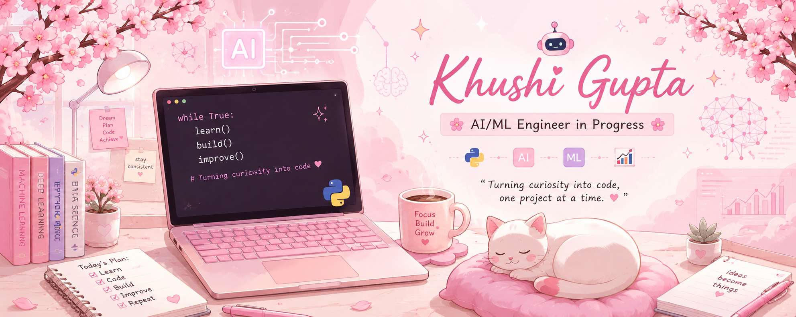

<p align="center">
  
</p>

<h1 align="center">Hi 👋, I'm Khushi Gupta</h1>

<h3 align="center">🌸 AI/ML Engineer in Progress 🌸</h3>

<p align="center">

</p>

<p align="center">

</p>

---

## 🌸 About Me

Hi! I'm **Khushi Gupta**, a Computer Science student passionate about **Artificial Intelligence**, **Machine Learning**, and software development.

I enjoy solving DSA problems, building AI-powered applications, and learning new technologies through real-world projects.

### 🌷 My Philosophy

> *Small progress every day eventually leads to big achievements.*

---

## 🌱 Currently Learning

- Striver A2Z DSA Sheet
- Daily LeetCode
- Artificial Intelligence
- Machine Learning
- FastAPI
- SQL
- Open Source

---

## 🎯 Current Goals

- Build impactful AI projects
- Improve problem-solving skills
- Contribute to Open Source
- Learn System Design
- Grow into an AI/ML Engineer through continuous learning

---

## 🛠 Tech Stack

<p align="center">


</p>

<p align="center">


</p>

---

## 📊 GitHub Statistics

<p align="center">


</p>

<p align="center">


</p>

---

## 🌸 What I'm Working On

- Striver A2Z DSA
- Daily LeetCode
- AI & Machine Learning
- Portfolio Projects
- Internship Preparation

---

## 🌷 Connect With Me

<p align="center">

<a href="https://www.linkedin.com/in/khushi-gupta-359189321">

</a>

<a href="mailto:khushiii.guptaa06@gmail.com">

</a>

<a href="https://leetcode.com/u/khushii_guptaa/">

</a>

<a href="https://www.kaggle.com/khuushhi">

</a>

</p>

---

## 🌸 My Journey

My journey into programming started with Python and gradually grew into a passion for Artificial Intelligence and Machine Learning.

Today, I'm strengthening my problem-solving skills through the Striver A2Z DSA Sheet while building real-world AI applications that solve meaningful problems.

Every project, every bug, and every solved problem teaches me something new—and that's what keeps me motivated.

---

## 🚀 Featured Projects

| Project | Description |
|---------|-------------|
| 🎫 Ticket Triage | AI-powered ticket classification & routing using Python, FastAPI & Machine Learning. |
| 🎓 Scholarship Matcher | Smart scholarship recommendation platform. |
| 🗣 Speaking AI *(Coming Soon)* | AI-powered English speaking practice platform. |
| 📚 DSA Repository | My complete Striver A2Z + LeetCode journey in Python. |

---

## 🏆 GitHub Trophies

<p align="center">


</p>

---

## ☕ Fun Fact

```python
while True:
    learn()
    build()
    improve()
```

> 🌸 Powered by curiosity, consistency, and lots of debugging.

---

## 📈 Contribution Graph

<p align="center">

</p>

---

## 💖 Developer Philosophy

> *"Turning curiosity into code, one project at a time."*

> *"I don't chase perfection. I chase progress."*

---

## 💌 Thanks for Visiting

<p align="center">

Thank you for visiting my profile! 🌸

I'm always excited to learn, collaborate, and build meaningful projects.

If you like my work, consider ⭐ starring a repository.

Let's build something amazing together!

</p>

<p align="center">


</p>
